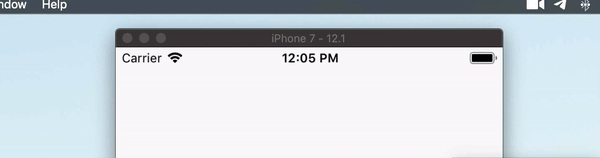

# connection_status_bar

A widget that animates when internet connection changes



## Getting Started

add it to your dependencies then use it anywhere on your app, usually in a widget that is on top of all of your widgets.

```dart
ConnectionStatusBar(
     height : 25, // double: default height
     width : double.maxFinite, // double: default width
     color : Colors.redAccent, // Color: default background color
     lookUpAddress : 'google.com', // String: default site to look up for checking internet connection
     endOffset : const Offset(0.0, 0.0), // Offset: default animation finish point offset
     beginOffset : const Offset(0.0, -1.0), // Offset: default animation start point offset
     animationDuration : const Duration(milliseconds: 200), // Duration: default animation duration
     // Text: default text
     title : const Text(
       'Please check your internet connection',
       style: TextStyle(color: Colors.white, fontSize: 14),
     ),
),
```
